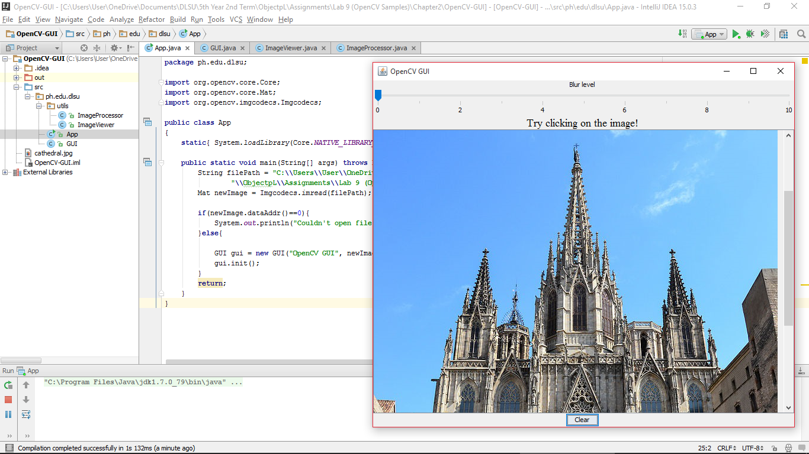

#OpenCV-GUI
Learning to make a Graphical User Interface (GUI)

#ScreenShot

#Code

###App
~~~
package ph.edu.dlsu;

import org.opencv.core.Core;
import org.opencv.core.Mat;
import org.opencv.imgcodecs.Imgcodecs;

public class App
{
    static{ System.loadLibrary(Core.NATIVE_LIBRARY_NAME); }

    public static void main(String[] args) throws Exception {
        String filePath = "C:\\Users\\User\\OneDrive\\Documents\\DLSU\\5th Year 2nd Term" +
                "\\ObjectpL\\Assignments\\Lab 9 (OpenCV Samples)\\Chapter2\\OpenCV-GUI\\cathedral.jpg";
        Mat newImage = Imgcodecs.imread(filePath);

        if(newImage.dataAddr()==0){
            System.out.println("Couldn't open file " + filePath);
        }else{

            GUI gui = new GUI("OpenCV GUI", newImage);
            gui.init();
        }
        return;
    }
}
~~~

###GUI
~~~
package ph.edu.dlsu;

import org.opencv.core.Mat;
import org.opencv.core.Point;
import org.opencv.core.Scalar;
import org.opencv.imgproc.Imgproc;
import ph.edu.dlsu.utils.ImageProcessor;

import javax.swing.*;
import javax.swing.event.ChangeEvent;
import javax.swing.event.ChangeListener;
import java.awt.*;
import java.awt.event.ActionEvent;
import java.awt.event.ActionListener;
import java.awt.event.MouseAdapter;
import java.awt.event.MouseEvent;

public class GUI {
    private JLabel imageView;
    private String windowName;
    private Mat image, originalImage;

    private final ImageProcessor imageProcessor = new ImageProcessor();

    public GUI(String windowName, Mat newImage) {
        super();
        this.windowName = windowName;
        this.image = newImage;
        this.originalImage = newImage.clone();
    }

    public void init() {
        setSystemLookAndFeel();
        initGUI();
    }

    private void initGUI() {
        JFrame frame = createJFrame(windowName);

        updateView(image);

        frame.pack();
        frame.setLocationRelativeTo(null);
        frame.setVisible(true);

    }

    private JFrame createJFrame(String windowName) {
        JFrame frame = new JFrame(windowName);
        frame.setLayout(new BoxLayout(frame.getContentPane(), BoxLayout.PAGE_AXIS));

        setupSlider(frame);
        setupImage(frame);
        setupButton(frame);

        frame.setDefaultCloseOperation(WindowConstants.EXIT_ON_CLOSE);
        return frame;
    }

    private void setupImage(JFrame frame) {
        JLabel mouseWarning = new JLabel("Try clicking on the image!", JLabel.CENTER);
        mouseWarning .setAlignmentX(Component.CENTER_ALIGNMENT);
        mouseWarning.setFont(new Font("Serif", Font.PLAIN, 18));
        frame.add(mouseWarning);

        imageView = new JLabel();

        final JScrollPane imageScrollPane = new JScrollPane(imageView);
        imageScrollPane.setPreferredSize(new Dimension(640, 480));

        imageView.addMouseListener(new MouseAdapter()
        {
            public void mousePressed(MouseEvent e)
            {
                Imgproc.circle(image,new Point(e.getX(),e.getY()),20, new Scalar(0,0,255), 4);
                updateView(image);
            }
        });

        frame.add(imageScrollPane);
    }

    private void setupButton(JFrame frame) {
        JButton clearButton = new JButton("Clear");
        clearButton.addActionListener(new ActionListener() {

            public void actionPerformed(ActionEvent event) {
                image = originalImage.clone();
                updateView(originalImage);
            }
        });
        clearButton.setAlignmentX(Component.CENTER_ALIGNMENT);
        frame.add(clearButton);
    }

    private void setupSlider(JFrame frame) {
        JLabel sliderLabel = new JLabel("Blur level", JLabel.CENTER);
        sliderLabel.setAlignmentX(Component.CENTER_ALIGNMENT);

        int minimum = 0;
        int maximum = 10;
        int initial =0;

        JSlider levelSlider = new JSlider(JSlider.HORIZONTAL,
                minimum, maximum, initial);

        levelSlider.setMajorTickSpacing(2);
        levelSlider.setMinorTickSpacing(1);
        levelSlider.setPaintTicks(true);
        levelSlider.setPaintLabels(true);
        levelSlider.addChangeListener(new ChangeListener() {

            public void stateChanged(ChangeEvent e) {
                JSlider source = (JSlider)e.getSource();
                int level = (int)source.getValue();
                Mat output = imageProcessor.blur(image, level);
                updateView(output);
            }
        });

        frame.add(sliderLabel);
        frame.add(levelSlider);
    }

    private void setSystemLookAndFeel() {
        try {
            UIManager.setLookAndFeel(UIManager.getSystemLookAndFeelClassName());
        } catch (ClassNotFoundException e) {
            e.printStackTrace();
        } catch (InstantiationException e) {
            e.printStackTrace();
        } catch (IllegalAccessException e) {
            e.printStackTrace();
        } catch (UnsupportedLookAndFeelException e) {
            e.printStackTrace();
        }
    }

    private void updateView(Mat newMat) {
        Image outputImage = imageProcessor.toBufferedImage(newMat);
        imageView.setIcon(new ImageIcon(outputImage));
    }

}
~~~

###ImageViewer
~~~
package ph.edu.dlsu.utils;

import org.opencv.core.Mat;

import javax.swing.*;
import java.awt.*;

public class ImageViewer {
    private JLabel imageView;

    public void show(Mat image){
        show(image, "");
    }

    public void show(Mat image,String windowName){
        setSystemLookAndFeel();

        JFrame frame = createJFrame(windowName);
        ImageProcessor imageProcessor = new ImageProcessor();
        Image loadedImage = imageProcessor.toBufferedImage(image);
        imageView.setIcon(new ImageIcon(loadedImage));

        frame.pack();
        frame.setLocationRelativeTo(null);
        frame.setVisible(true);

    }

    private JFrame createJFrame(String windowName) {
        JFrame frame = new JFrame(windowName);
        imageView = new JLabel();
        final JScrollPane imageScrollPane = new JScrollPane(imageView);
        imageScrollPane.setPreferredSize(new Dimension(640, 480));
        frame.add(imageScrollPane, BorderLayout.CENTER);
        frame.setDefaultCloseOperation(WindowConstants.EXIT_ON_CLOSE);
        return frame;
    }

    private void setSystemLookAndFeel() {
        try {
            UIManager.setLookAndFeel(UIManager.getSystemLookAndFeelClassName());
        } catch (ClassNotFoundException e) {
            e.printStackTrace();
        } catch (InstantiationException e) {
            e.printStackTrace();
        } catch (IllegalAccessException e) {
            e.printStackTrace();
        } catch (UnsupportedLookAndFeelException e) {
            e.printStackTrace();
        }
    }

}
~~~

###ImageProcessor
~~~
package ph.edu.dlsu.utils;

import org.opencv.core.Mat;
import org.opencv.core.Size;
import org.opencv.imgproc.Imgproc;

import java.awt.image.BufferedImage;
import java.awt.image.DataBufferByte;

public class ImageProcessor {

    public BufferedImage toBufferedImage(Mat matrix){
        int type = BufferedImage.TYPE_BYTE_GRAY;
        if ( matrix.channels() > 1 ) {
            type = BufferedImage.TYPE_3BYTE_BGR;
        }
        int bufferSize = matrix.channels()*matrix.cols()*matrix.rows();
        byte [] buffer = new byte[bufferSize];
        matrix.get(0,0,buffer); // get all the pixels
        BufferedImage image = new BufferedImage(matrix.cols(),matrix.rows(), type);
        final byte[] targetPixels = ((DataBufferByte) image.getRaster().getDataBuffer()).getData();
        System.arraycopy(buffer, 0, targetPixels, 0, buffer.length);
        return image;
    }

    public Mat blur(Mat input, int numberOfTimes){
        Mat sourceImage = new Mat();
        Mat destImage = input.clone();
        for(int i=0;i<numberOfTimes;i++){
            sourceImage = destImage.clone();
            Imgproc.blur(sourceImage, destImage, new Size(3.0, 3.0));
        }
        return destImage;
    }

}
~~~
